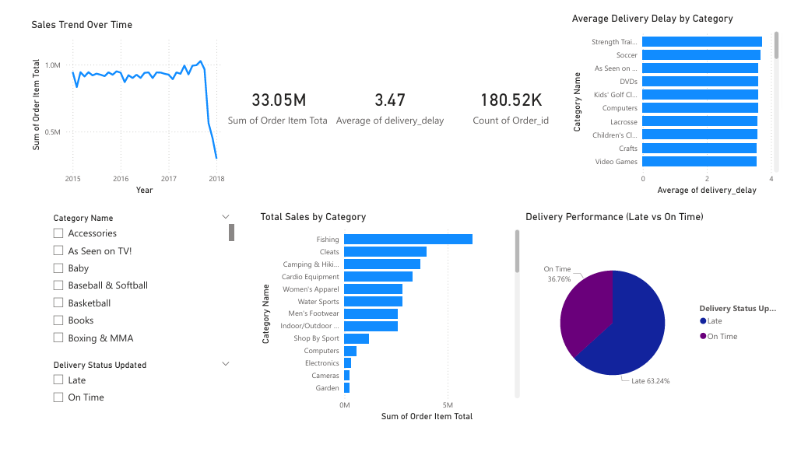

# 📊 Digital Procurement Analytics System Using AI

## 🚀 Overview
This project is an AI-driven procurement analytics system designed to analyze purchasing data, evaluate vendor performance, detect anomalies, and forecast demand trends.

It helps organizations make data-driven procurement decisions.

---
## 💼 Business Problem

Procurement teams face challenges such as:
- Unpredictable demand
- Vendor delays
- Overspending

This system helps organizations:
- Reduce late deliveries
- Identify unreliable vendors
- Optimize procurement costs

## 🎯 Objectives
- Analyze procurement and sales data
- Evaluate vendor and order performance
- Detect anomalies using Machine Learning
- Forecast demand trends
- Provide actionable business insights

---

## 🛠️ Tech Stack
- Python (Pandas, NumPy, Scikit-learn)
- SQL (MySQL)
- Jupyter Notebook
- Excel (Data Validation & Exploration)

---
## 📊 Dataset

The dataset contains **180K+ procurement transactions** from an e-commerce supply chain system.

Key fields include:

- Order ID
- Product Category
- Supplier
- Order Date
- Delivery Date
- Order Value
- Delivery Status

The dataset enables analysis of procurement spending patterns, supplier efficiency, and delivery performance.

---

## 📂 Project Structure
digital-procurement-analytics/
│── data/ # Raw & processed datasets
│── notebooks/ # Jupyter notebooks
│── sql/ # SQL queries
│── README.md

---

## 📊 Dashboard

An interactive **Power BI dashboard** was built to visualize procurement performance and delivery insights.

Dashboard highlights:

- Total procurement sales and transaction count
- Delivery performance (Late vs On-time)
- Category-wise procurement spending
- Average delivery delay by category
- Sales trend over time

  
## 🔍 Key Features

### 📊 Data Analysis
- Sales trends and customer behavior
- Category-wise performance

### 🤖 Machine Learning
- **Anomaly Detection** using Isolation Forest
- Identified unusual transactions and risks

### 📈 Forecasting
- Time-series analysis for demand prediction

### 🗄️ SQL Analysis
- Business queries for procurement insights
- Vendor performance evaluation

---

## 📌 Key Insights
- Total procurement volume exceeded **₹33M across 180K+ transactions**.
- Around **63% of deliveries were late**, indicating supply chain inefficiencies.
- Average delivery delay across orders was **3.47 days**.
- **Fishing, Cleats, and Camping & Hiking** categories accounted for the highest procurement spending.
- Certain categories such as **Strength Training equipment, Soccer products, and Electronics** experienced consistently higher delivery delays.
---

## 📊 Business Impact
- Identified categories with the highest delivery delays.
- Highlighted suppliers contributing to frequent late deliveries.
- Detected abnormal procurement transactions using machine learning.
- Enabled procurement teams to monitor KPIs through interactive dashboards.

---

## 💡 Learnings
- End-to-end data analytics workflow
- Data cleaning and preprocessing
- Machine learning model implementation
- SQL + Python integration

---

## 👨‍💻 Author
Ayush Yadav

